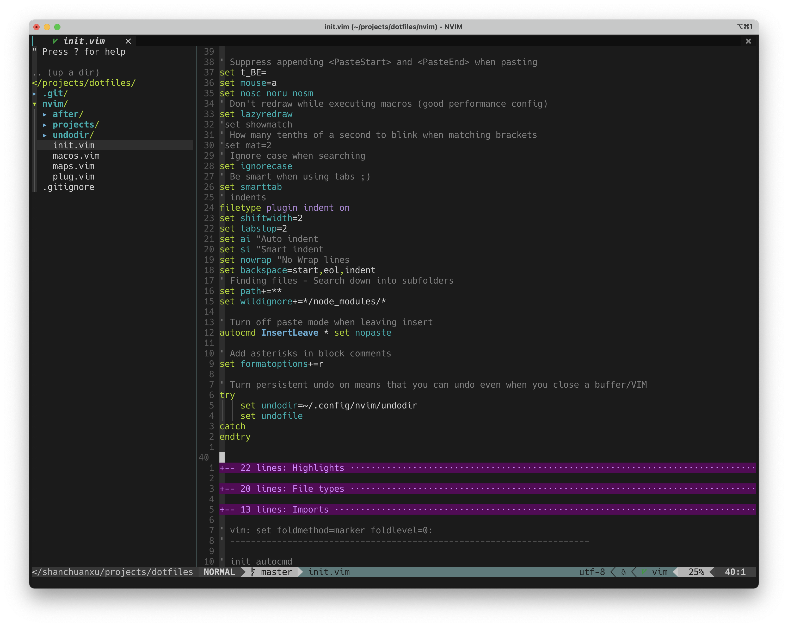

Fork from https://github.com/craftzdog/dotfiles-public and then made my own customize. 

## fish

### plugins

- jorgebucaran/fisher - for plugin management
- jethrokuan/z - for quick jump between folders
- IlanCosman/tide@v5 - theme
- edc/bass - support bash
- jethrokuan/fzf - fzf integration
- jorgebucaran/nvm.fish - nvm integration
- danhper/fish-ssh-agent - ssh-agent integration

### dependencies

- fzf - fuzzy finder
- nvm - nodejs env management
- [ghq](https://github.com/x-motemen/ghq) - remote repository management
- [exa](https://the.exa.website/) - better ls in macos
- [Nerd fonts](https://github.com/ryanoasis/nerd-fonts) - powerline-patched fonts. I use Hack Nerd

## vim

### plugins

- vim-plug - for plugin management
- nvim-lspconfig - for neovim's built-in LSP
- nvim-treesitter - for syntax highlight, folding, indent
- nvim-cmp - for auto-complete, even github coplit is included
- telescope - for quick jump list of buffers, files, live-grep
- bufferline - for buffer and tab management
- lualine - for vim status bar customization
- clipbard-image - for quick paste image in markdown files
- nvim-projectconfig - for customize vim config for some projects
